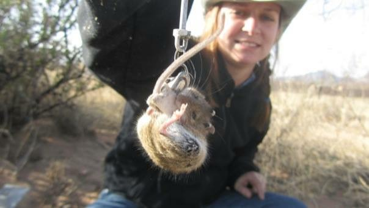

<table class="wide">
<tr>
  <td class="center">
    
  </td>
</tr>
</table>

  

      <ul class="nav">
          <li><a href="https://github.com/emchristensen">GitHub</a></li>
          <li><a href="https://twitter.com/emchriste">Twitter</a></li>
      </ul>
  

